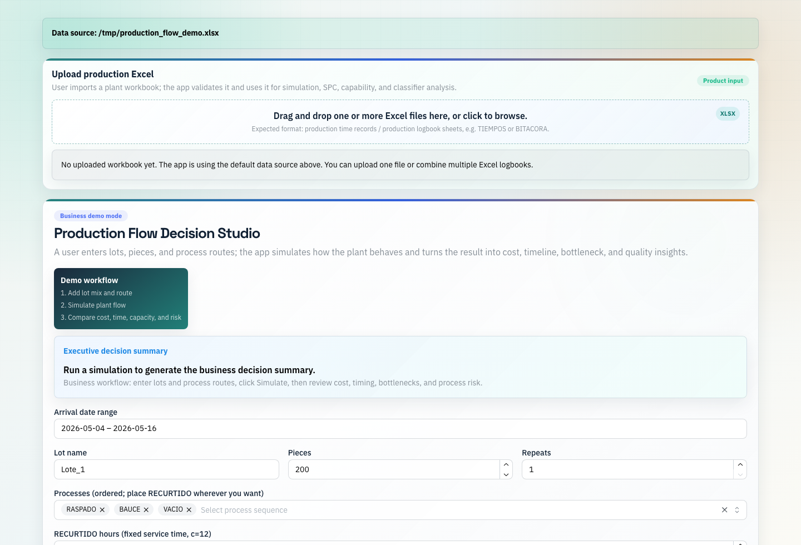
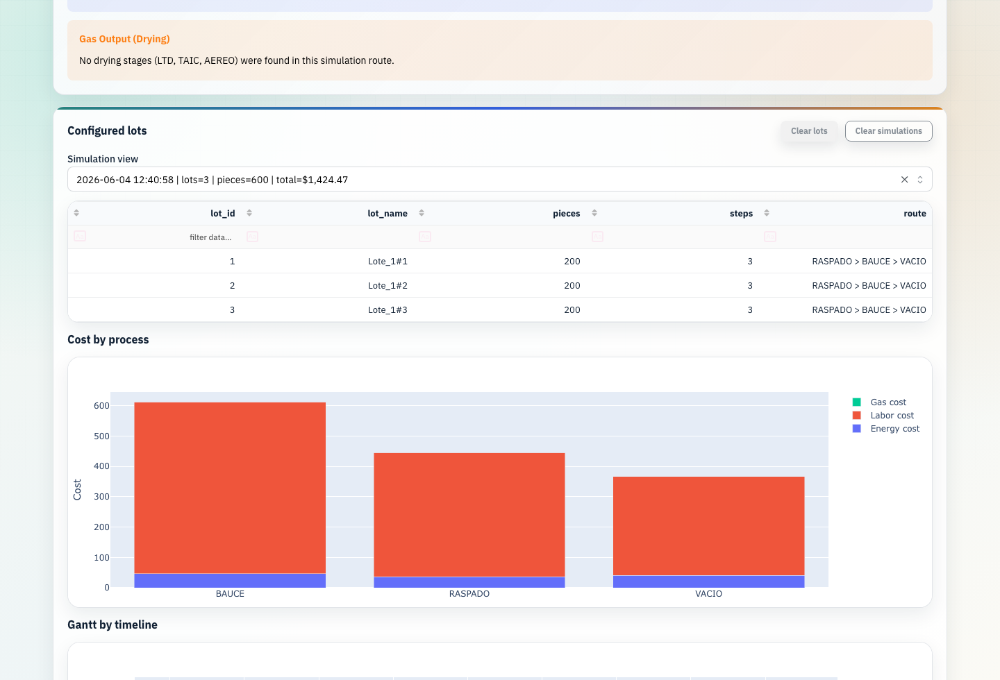
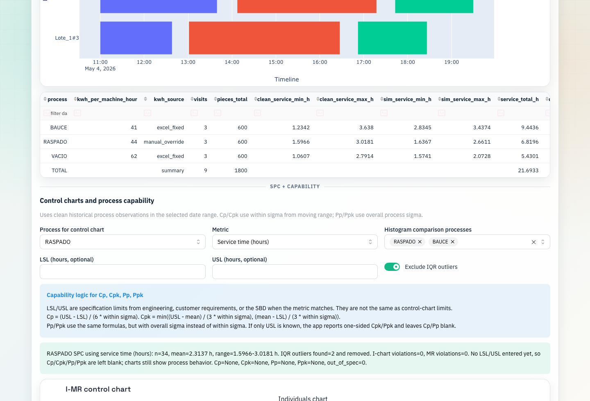

# Production Flow Decision Studio

Dash + SimPy application for production-flow simulation, cost modeling, queueing analysis, and statistical process analysis in a leather manufacturing setting.

This project reflects work from my first operations research / data science role in a production plant. The plant had useful timing data in Excel logbooks, but those files were difficult to use for planning. I built Python dashboards and simulation workflows to transform raw production logs into operational insights on throughput, bottlenecks, machine capacity, and process costs.

No production workbooks or proprietary plant data are included in this repository.

## Quick Look

Screenshots below use a synthetic demo workbook. No production workbooks or proprietary plant data are included.







## Project Summary

The app turns raw production logbook data into an interactive planning workflow:

1. Upload one or more Excel production logbooks.
2. Clean and standardize process, timestamp, machine, and piece-count fields.
3. Enter lots, piece counts, repeats, and process routes.
4. Simulate lot movement through plant processes using SimPy.
5. Review timeline, throughput, bottlenecks, machine capacity, process cost, SPC, capability, and Bayesian classifier outputs.

The main goal was to connect data cleaning, EDA, queueing simulation, statistical process control, and business reporting in one tool that a non-technical plant user could operate.

## What I Worked On

- Built Python dashboards and simulation workflows to transform raw production logs into operational insights on throughput, bottlenecks, machine capacity, and process costs.
- Performed EDA, data cleaning, and statistical modeling on plant process data to support queueing analysis, capability studies, and production planning decisions.
- Developed OR/data science tools for queueing simulation, control charts, process capability analysis, and Bayesian process classification.
- Engineered service-time metrics from start and finish timestamps and standardized process names across Excel logbooks.
- Modeled process capacity using machine/server counts and process-specific business rules.
- Estimated energy, labor, and drying gas costs from simulated operating time.
- Added Gantt charts to visualize how lots move through the plant over time.
- Dockerized the app for repeatable local deployment.

## Business Questions the App Helps Answer

- How long will a proposed set of lots take to move through the plant?
- Which process is the main cost driver?
- Which route creates the longest lead time or bottleneck?
- How do labor, energy, and gas costs change by lot mix?
- Which processes show unstable, unusual, or out-of-spec timing behavior?
- Are process times within user-defined lower and upper specification limits?

## Data Pipeline

The app is designed for production logbook-style Excel files. The parser looks for fields such as:

- `FECHA`
- `FECHA INICIAL`
- `FECHA FINAL`
- `PROCESO`
- `MAQUINA`
- `PIEZAS`
- `OPERADOR`

Pipeline steps:

1. Read one or more uploaded Excel files.
2. Normalize column names and process labels.
3. Parse timestamp fields into usable datetime columns.
4. Calculate service/process time from finish time minus start time.
5. Remove invalid rows such as missing timestamps, negative durations, and unusable records.
6. Apply IQR-based outlier screening for EDA and capability views.
7. Build process-level inputs for simulation and reporting.

The app can start without a default workbook. Users can upload Excel files directly through the browser.

## Simulation Method

The simulation is route-driven and empirical.

A user enters:

- Lot name
- Number of pieces
- Number of repeated lots
- Process route in the selected order

The app creates SimPy resources for plant processes and simulates each lot moving through its selected route. Lots can overlap in time, so different lots may be processed at different stations at the same time.

Simulation outputs include:

- Total lead time
- Service time by process
- Queue/wait time
- Between-process transfer gaps
- Process cost
- Gantt timeline

A random uniform transfer/setup gap is added between process steps to avoid identical deterministic runs while keeping the delay inside a realistic operating range.

## Cost Model

The simulator estimates cost by process and by total run.

Cost components:

- Energy cost
- Labor cost
- Drying gas cost

Energy cost is estimated from:

```text
machine hours * kWh per machine-hour * energy price per kWh
```

Labor cost is estimated from:

```text
labor hours * labor rate per hour
```

Drying gas cost is handled as a per-piece cost for drying-related processes where applicable.

## Statistical Process Analysis

The app includes a process analysis section for timing metrics.

Implemented views:

- Individuals control chart
- Moving range chart
- Capability histogram
- Process comparison histogram
- User-entered `LSL` and `USL`
- `Cp`, `Cpk`, `Pp`, and `Ppk`

The app does not invent specification limits. `LSL` and `USL` should come from production, engineering, or customer requirements.

## Bayesian Classifier

The app includes a simple Bayesian classifier for comparing two process timing distributions. Given a service time, the classifier estimates which selected process that time most closely resembles.

This was added as a decision-support tool, not as a final production labeler.

## Repository Structure

```text
new_sim_app.py          Main simulator app
app.py                  Core data cleaning, EDA, queueing, and helper logic
bayes_classifier_app.py Bayesian classifier module
process_eda.py          Standalone per-process EDA utility
assets/studio.css       App styling
Dockerfile              Docker image definition
docker-compose.yml      Docker Compose configuration
requirements.txt        Python dependencies
```

## Run Locally

Install dependencies:

```bash
python3 -m pip install -r requirements.txt
```

Run the app:

```bash
SIM_APP_PORT=8050 python3 -u new_sim_app.py
```

Open:

```text
http://127.0.0.1:8050
```

## Run with Docker

Build the image:

```bash
docker build -t empirical-lot-cost-simulator .
```

Run the container:

```bash
docker run --rm -p 8050:8050 empirical-lot-cost-simulator
```

Open:

```text
http://127.0.0.1:8050
```

Docker Compose:

```bash
docker compose up --build
```

Optional local data mount:

```text
./data/production.xlsx -> /app/data/production.xlsx
./data/energy.xlsx     -> /app/data/energy.xlsx
```

## Environment Variables

```bash
SIM_APP_HOST=127.0.0.1        # Use 0.0.0.0 in Docker
SIM_APP_PORT=8050
RASPADO_XLSX_PATH=/path/to/default_workbook.xlsx
RASPADO_SHEET=TIEMPOS
ENERGY_REF_XLSX_PATH=/path/to/energy_reference.xlsx
ENERGY_REF_SHEET=Hoja1
```

## Skills Demonstrated

- Operations research simulation
- Production process EDA
- Queueing analysis and capacity modeling
- Data cleaning from Excel-based operational records
- Cost modeling for plant processes
- Statistical process control, Cp/Cpk, and Pp/Ppk capability analysis
- Interactive dashboard development with Dash and Plotly
- Docker-based local deployment

## Limitations

- The quality of the simulation depends on the quality of the historical timing records.
- Plant-specific capacity and cost assumptions should be reviewed before using the app in another environment.
- Specification limits for capability analysis must be provided by the business.
- The Docker image runs the Dash development server; a production deployment should use a production WSGI setup.
